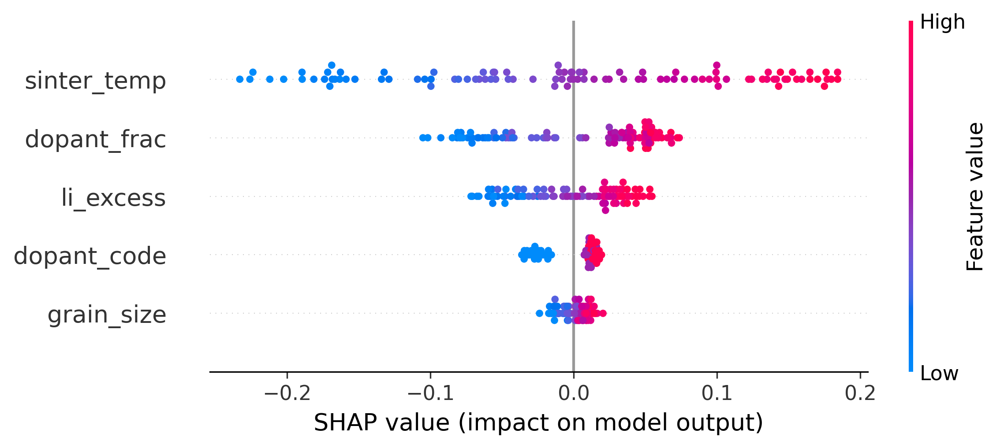
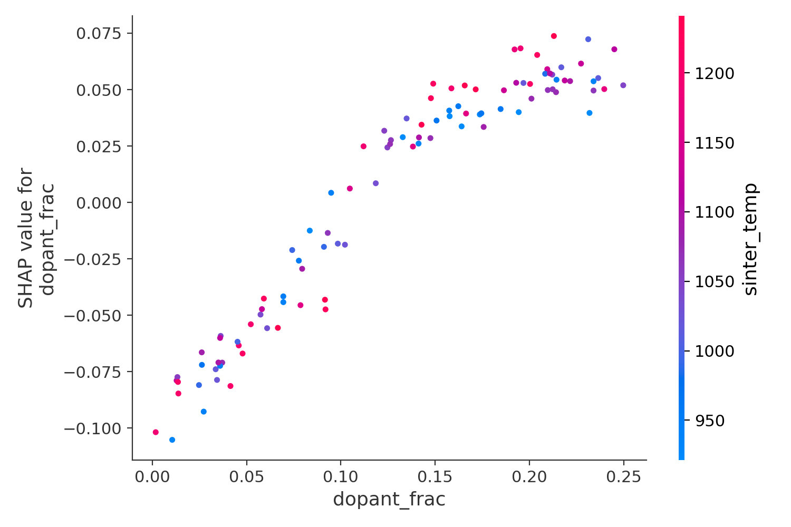

PolymerMI : Polymer Property Prediction & Optimization (MI/BO/XAI Pipeline)

Purpose 

This Pipeline was developed as a lightweight tool that can support laboratory research using only a Linux-based virtual environment. By predicting material properties and performing automated exploration before actual experiments, it helps reduce time and experimental costs. In addition,XAI-based analysis provides interpretability that can guide experiment design and optimization.

SHAP summary plot

Overview
This repository provides a lightweight but complete machine learning pipeline for predicting and optimizing polymer properties.
It demonstrates core techniques in Materials Informatics (MI), including:
* Synthetic dataset generation
* Random Forest baseline models
* Feature importance analysis (Permutation / Gini)
* Bayesian Optimization (Optuna)
* Gaussian Process Regression (GPR)
* SHAP-based XAI visualization
* Automated workflow (run_all.sh)

Target Property: polymer density (synthetic)
Features: mw, hyd, xlink, side, tg_like

Folder Structure

--data_synth.py     # synthetic polymer dataset generator

--mi_baseline.py    # RF-based MI baseline + feature importance

--bo.optuna.py      # Bayesian Optimization (RF)    

--bo_gpr.py         # Bayesian Optimization (GPR)

--xai_perm_pdp.py   # Permutation importance + PDP plots

--xai_shap.py       # SHAP summary & dependence plots

--results/          # Figures, CSV logs, best parameters

--run_all.sh        # full pipeline runner

Example Outputs
* R² = 0.97 (RF baseline)
* Bayesian Optimization best density = 1.96
* GPR kernel after fitting
* SHAP summary / dependence plots

How to Run 
bash run_all.sh

Or run individual modules

-python data_synth.py

-python mi_baseline.py

-python bo_optuna.py

-python bo_gpr.py

-python shap_analysis.py

#Environment

-Python 3.10

-Tested in a conda environment (`mi310`).

Purpose of This Repository
This project demonstrates essential workflows in modern Materials Informatics
* nonlinear structure-property modeling
* ML-based polymer property prediction
* ML-assisted polymer design (BO)
* interpretable ML for materials (XAI)

  License
  MIT License

  #LLZO Ionic Conductivity (Synthetic) — SHAP Analysis#

  

  Target: Ionic conductivity trend sigma(ion) in LLZO (synthetic).
  Insight: Sintering temperature dominates sigma(ion), followed by dopant fraction
  and Li excess with clear non-linear effects; dopant type and grain size are secondary.

  

  Dopant fraction was selected for further analysis due to its strong non-linear
  contribution observed in the global SHAP summary.

  
  Dependence: The effect of dopant fraction on sigma(ion) is non-linear and modulated
  by sintering temoerature, indicating coupled processing-composition effects.
  

  
   How to run
  
  -python beeswarm.py
  
  -python shap_LLZO.py

